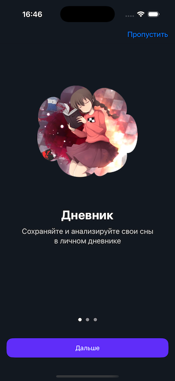
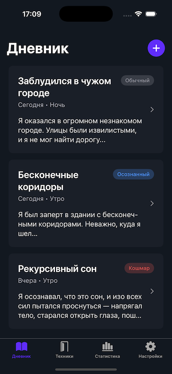
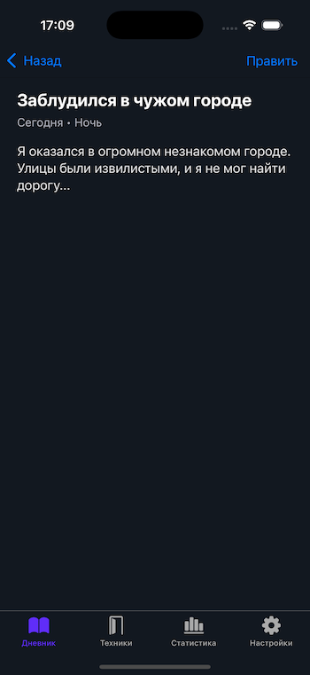
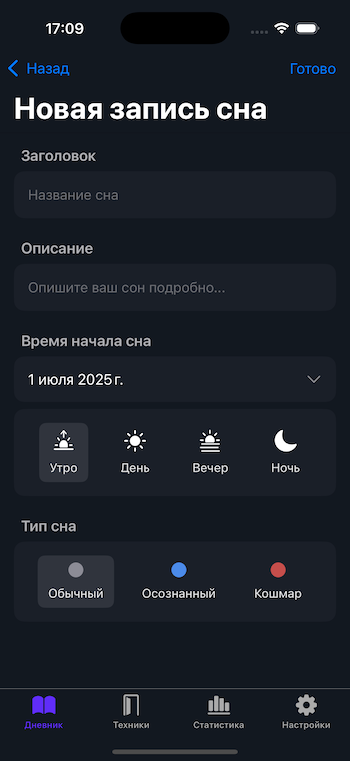
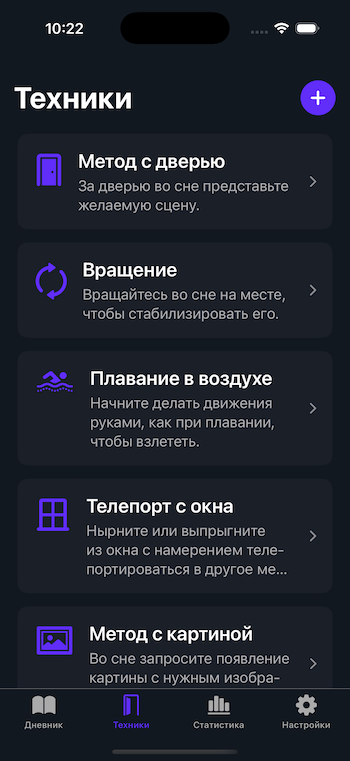
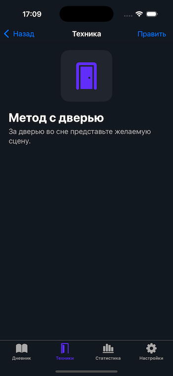
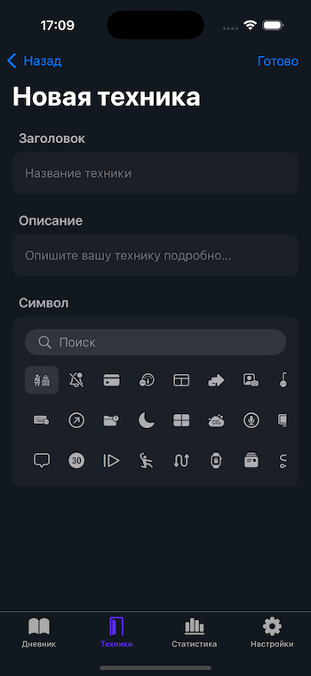
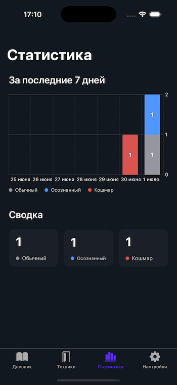

# DreamDiary 🐇
Приложение для ведения дневника сновидений и освоения техник осознанных сновидений.

## Особенности
* SwiftUI.
* Composable Architecture (TCA).
* SwiftData.
* Swift Testing.
* Swift Charts.
* SFSafeSymbols для безопасной работы с SF Symbols.
* Data Seeding.

## Экраны
### Onboarding

### DreamList

### DreamDetail

### EditDream

### TechniqueList

### TechniqueDetail

### EditTechnique

### Stats
